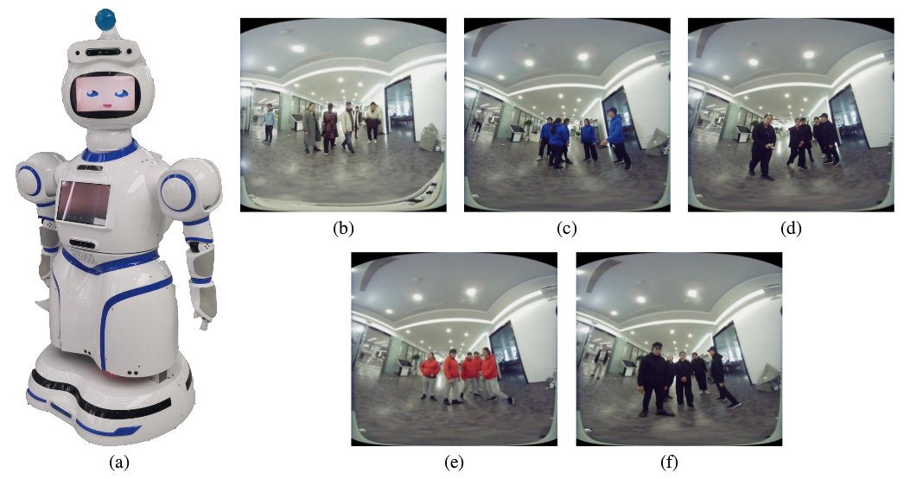
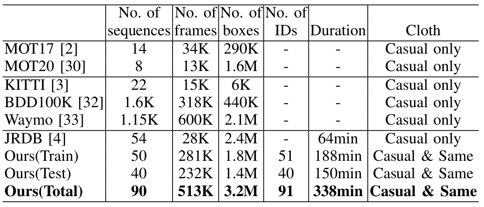
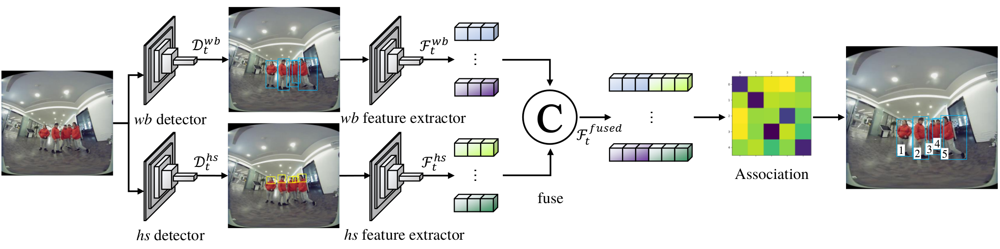

# TGRMPT: A Head-Shoulder Aided Multi-Person Tracker and a New Large-Scale Dataset for Tour-Guide Robot
## Overview
1. The tour-guide robot used to collect our dataset and the dataset snapshots are shown as follows.
<div align="center">

</div>
2. Statistical comparisons between our dataset and existing datasets. K = Thousand, M = Million, min = minutes.
<div align="center">

</div>
3. The pipeline of our method.
<div align="center">

</div>

## How to
1. Download our dataset from [Baidu Netdisk](https://pan.baidu.com/s/1SfAkMLC8Tc_qpoT3Qes6Mw). The fetch code is `v0hw`. Assume the dataset is downloaded to `${dataset}`.
2. Change working directory to `${dataset}`. Run the following command to extract compressed files.
```shell
cd iros2022
find . -type f -name "*.tar" | xargs -i sh -c 'a=`dirname {}`; tar -xf {} -C $a'
```
3. Clone our source code. Assume the code is cloned into `${TGRMPT}`.
4. Create local link to dataset. `cd ${TGRMPT} & ln -s ${dataset}/iros2022 dataset`
5. Detection, see [README](detection/README.md).
6. ReID, see [README](reid/README.md).
7. Tracking and evaluation, see [README](tracking/README.md).
8. Deploy, see [README](deploy/README.md).